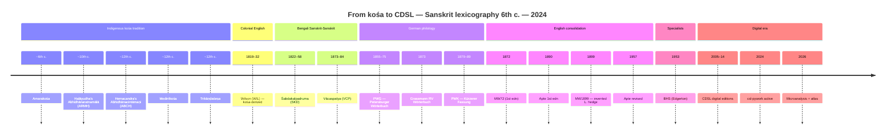

# Lexicographic timeline

From the indigenous *kośa* tradition (~6th c.) through to the Cologne Digital Sanskrit Lexicon (2024).

The full Mermaid timeline:

For the fully-detailed version with all 50+ dates, sources, and CDSL repo links: [timeline-en.md](https://github.com/sanskrit-lexicon/MWS/blob/docs-pass/papers/microanalysis/figures/timeline-en.md).

[Русская версия →](/ru/tools/timeline)

---

Source: [DICT_PROFILE Historical background](https://github.com/sanskrit-lexicon/MWS/blob/docs-pass/DICT_PROFILE.md#historical-background) and [Lineage section](https://github.com/sanskrit-lexicon/MWS/blob/docs-pass/DICT_PROFILE.md#lineage-wil--koshas-mw--pwg). CC-BY-SA-4.0.
