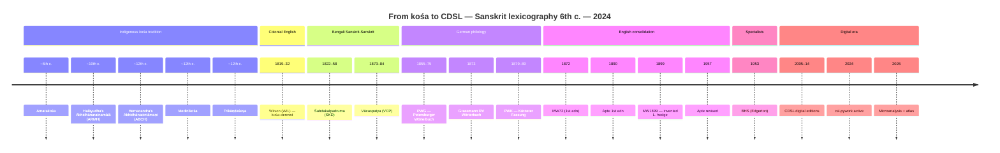

# Lexicographic timeline

Data-driven diachronic spine for the CDSL inventory: when each dictionary was published (or spanned multi-volume years), which language family it belongs to, how large its sanhw1 lemma set is, and which titles Cologne marks deprecated. Built from committed inventory rows — not hard-coded dates in page prose.

Companion pages: [Dictionary genealogy](lexicography) (lemma counts and inheritance — do not re-derive here), [All-dictionary coverage](dictionary-coverage) (structure-fit scatter), agenda item V2 in [ATLAS_RESEARCH_AGENDA.md](https://github.com/sanskrit-lexicon/csl-atlas/blob/main/docs/ATLAS_RESEARCH_AGENDA.md).

```js
const invRaw = await FileAttachment("../data/lexicographic-structure/dictionary_inventory.csv").csv({typed: false});
```

```js
import * as Plot from "npm:@observablehq/plot";
import { csvDownloadButton } from "../lib/csv-download.js";
```

```js
const ORIENT_YEAR = new Date().getFullYear();

function parseYear(v) {
  if (v == null) return null;
  const s = String(v).trim();
  if (!s || s === "n/a") return null;
  if (/^ongoing$/i.test(s)) return ORIENT_YEAR;
  const m = s.match(/-?\d{3,4}/);
  return m ? +m[0] : null;
}

function parseVolumes(v) {
  if (v == null) return 1;
  const s = String(v).trim();
  if (!s || s === "n/a") return 1;
  const m = s.match(/\d+/);
  return m ? Math.max(1, +m[0]) : 1;
}

const inv = invRaw.map((d) => {
  const start = parseYear(d.start_year);
  const endRaw = d.end_year;
  const ongoing = String(endRaw || "").toLowerCase() === "ongoing";
  let end = parseYear(endRaw);
  if (start != null && end == null) end = start;
  if (start != null && end != null && end < start) end = start;
  const lemmas = +d.sanhw1_lemmas || 0;
  const vols = parseVolumes(d.n_volumes);
  // Bar inset: multi-volume titles fill more of the row (volume-width signal).
  const inset = Math.max(0, 7 - Math.min(7, vols));
  return {
    code: d.code,
    year: parseYear(d.year) ?? start,
    start,
    end,
    ongoing,
    lifespan: start != null && end != null ? end - start + 1 : null,
    n_volumes: vols,
    n_volumes_raw: d.n_volumes,
    volInset: inset,
    letter_coverage: d.letter_coverage,
    full_name: d.full_name,
    language_pair: d.language_pair,
    family: d.family,
    author: d.author_or_compiler,
    deprecated: String(d.deprecated).toLowerCase() === "yes",
    in_sanhw1: String(d.in_sanhw1).toLowerCase() === "yes",
    sanhw1_lemmas: lemmas,
    notes: d.notes
  };
});

const dated = inv.filter((d) => d.start != null && d.end != null);
const undated = inv.filter((d) => d.start == null);
const invN = inv.length;
const plotN = dated.length;
const familyOrder = [...new Set(dated.map((d) => d.family))].sort((a, b) => {
  const aMin = Math.min(...dated.filter((d) => d.family === a).map((d) => d.start));
  const bMin = Math.min(...dated.filter((d) => d.family === b).map((d) => d.start));
  return aMin - bMin || a.localeCompare(b);
});
const codeByFamily = dated
  .slice()
  .sort((a, b) => {
    const fi = familyOrder.indexOf(a.family) - familyOrder.indexOf(b.family);
    if (fi) return fi;
    return a.start - b.start || a.code.localeCompare(b.code);
  })
  .map((d) => d.code);

const tip = (d) =>
  [
    `${d.code} — ${d.full_name}`,
    `${d.start}${d.ongoing ? "–ongoing" : d.end !== d.start ? `–${d.end}` : ""} · ${d.family}`,
    d.language_pair,
    d.author,
    d.sanhw1_lemmas ? `${d.sanhw1_lemmas.toLocaleString()} sanhw1 lemmas` : "not in sanhw1",
    d.n_volumes_raw && d.n_volumes_raw !== "n/a" ? `${d.n_volumes_raw} vol.` : null,
    d.deprecated ? "deprecated (Cologne)" : null
  ]
    .filter(Boolean)
    .join("\n");
```

## Trust Block

- Evidence: [`data/dictionary_inventory.csv`](https://github.com/sanskrit-lexicon/csl-atlas/blob/main/data/dictionary_inventory.csv) (synced into `src/data/lexicographic-structure/dictionary_inventory.csv`); **${invN}** inventory rows, **${plotN}** with parseable `start_year` (AMAR and other pre-modern markers without year columns are excluded from plots, not invented).
- Limitations: **orientation dates, not exact usage dating** of Sanskrit. `start_year`/`end_year` are publication spans for printed editions; multi-volume works use first→last volume years. `end_year=ongoing` (e.g. PD) is clipped to the atlas build year for display only. Lemma sizes are sanhw1 counts, not print page counts.
- Validation: checked by `npm run build`; inventory columns required: `code,year,start_year,end_year,family,deprecated,n_volumes,sanhw1_lemmas,full_name,language_pair,author_or_compiler`.
- Owner repo: `csl-atlas`.
- Next use: orient a temporal claim (PH3 / PH7 / PH8) on this spine, then verify in dictionary chapters or source-linked records. Full Heaps/era V4 ribbons need union TSV excerpts — not this page.


## 1. Lifespan bars by dictionary (family colour)

Each bar runs `start_year` → `end_year`. Single-year editions are thin marks. **Faded bars** = Cologne `deprecated=yes` (still historical evidence; not the preferred lookup surface). Hover for full name, language pair, and author.

```js
display(Plot.plot({
  width: Math.min(width, 980),
  height: 28 + codeByFamily.length * 16,
  marginLeft: 72,
  marginRight: 24,
  marginBottom: 40,
  x: {label: "Publication year (orientation)", grid: true},
  y: {label: null, domain: codeByFamily},
  color: {legend: true, domain: familyOrder, scheme: "tableau10", label: "Family"},
  marks: [
    Plot.barX(dated, {
      x1: "start",
      x2: (d) => d.end + (d.end === d.start ? 0.6 : 0),
      y: "code",
      fill: "family",
      fillOpacity: (d) => (d.deprecated ? 0.32 : 0.88),
      stroke: (d) => (d.deprecated ? "#444" : "none"),
      strokeWidth: (d) => (d.deprecated ? 1 : 0),
      strokeDasharray: (d) => (d.deprecated ? "3,2" : null),
      title: tip
    }),
    Plot.ruleX([ORIENT_YEAR], {stroke: "#999", strokeDasharray: "4,4", strokeOpacity: 0.5})
  ]
}));
```

**Reading note.** Clusters on the y-axis follow family order (earliest family first), then start year inside the family — the same “family lane” story as the agenda V2 mockup, with readable dictionary codes.

## 2. Family lanes (aggregated spine)

Same spans, y = language **family**. Overlapping bars on a lane are expected (siblings published in the same century). Useful for “which tradition is active when?” without scanning every code.

```js
display(Plot.plot({
  width: Math.min(width, 980),
  height: 80 + familyOrder.length * 42,
  marginLeft: 140,
  marginRight: 24,
  marginBottom: 40,
  x: {label: "Publication year (orientation)", grid: true},
  y: {label: null, domain: familyOrder},
  color: {legend: true, domain: familyOrder, scheme: "tableau10"},
  marks: [
    Plot.barX(dated, {
      x1: "start",
      x2: (d) => d.end + (d.end === d.start ? 0.8 : 0),
      y: "family",
      fill: "family",
      fillOpacity: (d) => (d.deprecated ? 0.25 : 0.55),
      stroke: "#fff",
      strokeWidth: 0.5,
      title: tip
    }),
    Plot.text(
      dated.filter((d) => ["WIL", "PWG", "PW", "MW", "AP", "SKD", "VCP", "PD", "BHS", "BUR", "BOP"].includes(d.code)),
      {
        x: (d) => (d.start + d.end) / 2,
        y: "family",
        text: "code",
        fontSize: 9,
        fill: "currentColor",
        dy: -10
      }
    )
  ]
}));
```

## 3. Volume width and multi-volume span

Bar **length** is still the publication span; bar **height** scales with parsed `n_volumes` (multi-volume Petersburg / encyclopedic projects stand out). Single-volume dictionaries stay thin.

```js
display(Plot.plot({
  width: Math.min(width, 980),
  height: 28 + codeByFamily.length * 16,
  marginLeft: 72,
  marginRight: 24,
  marginBottom: 40,
  x: {label: "Publication year (orientation)", grid: true},
  y: {label: null, domain: codeByFamily},
  color: {legend: true, domain: familyOrder, scheme: "tableau10"},
  marks: [
    Plot.barX(dated, {
      x1: "start",
      x2: (d) => d.end + (d.end === d.start ? 0.6 : 0),
      y: "code",
      fill: "family",
      fillOpacity: (d) => (d.deprecated ? 0.3 : 0.85),
      insetTop: "volInset",
      insetBottom: "volInset",
      title: tip
    })
  ]
}));
```

Multi-volume titles (PWG, PW, PD, …) fill more of the row height; single-volume titles stay thin.

## 4. Lemma size at publication year

Dot at each dictionary’s start year; area ∝ sanhw1 lemmas (0-lemma reverse-direction / incomplete titles sit on the axis). This is **inventory size at digitisation**, not growth of Sanskrit itself. Lemma bars by code live on [lexicography](lexicography) — this panel only places size in time.

```js
const withLemmas = dated.filter((d) => d.sanhw1_lemmas > 0);
```

```js
display(Plot.plot({
  width: Math.min(width, 980),
  height: 420,
  marginLeft: 70,
  marginBottom: 48,
  x: {label: "Start year", grid: true},
  y: {label: "sanhw1 lemmas", grid: true},
  color: {legend: true, domain: familyOrder, scheme: "tableau10"},
  r: {range: [4, 28]},
  marks: [
    Plot.dot(withLemmas, {
      x: "start",
      y: "sanhw1_lemmas",
      r: "sanhw1_lemmas",
      fill: "family",
      fillOpacity: (d) => (d.deprecated ? 0.35 : 0.75),
      stroke: (d) => (d.deprecated ? "#333" : "white"),
      strokeWidth: 1,
      title: tip
    }),
    Plot.text(
      withLemmas.filter((d) => d.sanhw1_lemmas >= 40000 || ["WIL", "GRA", "CCS", "BHS"].includes(d.code)),
      {
        x: "start",
        y: "sanhw1_lemmas",
        text: "code",
        dy: -14,
        fontSize: 10
      }
    )
  ]
}));
```

## 5. Coverage ribbon — cumulative tradition steps

Thin cumulative strip: for each dictionary’s `start_year` (sorted), how many inventory titles have *appeared* by that year. **Not** the full Heaps/era V4 programme (that needs union headword excerpts). Use this as “when does the printed tradition thicken?”; for structure-fit vs size see [dictionary-coverage](dictionary-coverage).

```js
const ribbon = (() => {
  const sorted = dated.slice().sort((a, b) => a.start - b.start || a.code.localeCompare(b.code));
  let n = 0;
  return sorted.map((d) => {
    n += 1;
    return {year: d.start, n, code: d.code, family: d.family, full_name: d.full_name};
  });
})();
```

```js
display(Plot.plot({
  width: Math.min(width, 980),
  height: 280,
  marginLeft: 50,
  marginBottom: 40,
  x: {label: "Year of first inventory appearance", grid: true},
  y: {label: "Cumulative dictionaries", grid: true},
  color: {legend: true, domain: familyOrder, scheme: "tableau10"},
  marks: [
    Plot.lineY(ribbon, {
      x: "year",
      y: "n",
      curve: "step-after",
      stroke: "var(--theme-foreground-focus)",
      strokeWidth: 2
    }),
    Plot.dot(ribbon, {
      x: "year",
      y: "n",
      fill: "family",
      r: 4,
      title: (d) => `${d.code} (${d.year})\n${d.full_name}\ncumulative n=${d.n}`
    }),
    Plot.ruleY([0])
  ]
}));
```

```js
display(csvDownloadButton(
  ribbon.map((d) => ({year: d.year, cumulative_n: d.n, code: d.code, family: d.family})),
  "timeline-coverage-ribbon.csv"
));
```

## Inventory excerpt

All dated rows used above (downloadable). Undated inventory rows (e.g. AMAR without year fields) are listed at the bottom of the table filter if present in the raw file.

```js
const tableRows = dated
  .slice()
  .sort((a, b) => a.start - b.start || a.code.localeCompare(b.code))
  .map((d) => ({
    code: d.code,
    start_year: d.start,
    end_year: d.ongoing ? "ongoing" : d.end,
    family: d.family,
    language_pair: d.language_pair,
    sanhw1_lemmas: d.sanhw1_lemmas,
    n_volumes: d.n_volumes_raw,
    deprecated: d.deprecated ? "yes" : "no",
    full_name: d.full_name,
    author_or_compiler: d.author
  }));
```

```js
display(Inputs.table(tableRows, {
  columns: ["code", "start_year", "end_year", "family", "sanhw1_lemmas", "n_volumes", "deprecated", "full_name"],
  width: {
    code: 70,
    start_year: 70,
    end_year: 70,
    family: 140,
    sanhw1_lemmas: 100,
    n_volumes: 80,
    deprecated: 80
  }
}));
```

```js
display(csvDownloadButton(tableRows, "dictionary-inventory-timeline-excerpt.csv"));
```

${undated.length
  ? `**Undated inventory rows excluded from plots (${undated.length}):** ${undated.map((d) => d.code).join(", ")} — year fields are \`n/a\` in the feed; do not invent a century mark on this page.`
  : ""}

---

## Narrative version (Mermaid)

The static story arc from indigenous *kośa* tradition through colonial English, Bengali Skt–Skt, German philology, English consolidation, specialists, and the digital era. **Data plots above are authoritative for CDSL inventory years**; this block is the teaching narrative (includes pre-modern markers and CDSL tooling milestones that are not inventory rows).


```mermaid
timeline
    title From kośa to CDSL — Sanskrit lexicography 6th c. — 2024
    section Indigenous kośa tradition
        ~6th c.   : Amarakośa
        ~10th c.  : Halāyudha's Abhidhānaratnamālā (ARMH)
        ~12th c.  : Hemacandra's Abhidhānacintāmaṇi (ABCH)
        ~12th c.  : Medinīkośa
        ~12th c.  : Trikāṇḍaśeṣa
    section Colonial English
        1819–32   : Wilson (WIL) — kośa-derived
    section Bengali Sanskrit-Sanskrit
        1822–58   : Śabdakalpadruma (SKD)
        1873–84   : Vācaspatya (VCP)
    section German philology
        1855–75   : PWG — Petersburger Wörterbuch
        1873      : Grassmann RV Wörterbuch
        1879–89   : PWK — Kürzerer Fassung
    section English consolidation
        1872      : MW72 (1st edn)
        1890      : Apte 1st edn
        1899      : MW1899 — invented L. hedge
        1957      : Apte revised
    section Specialists
        1953      : BHS (Edgerton)
    section Digital era
        2005–14   : CDSL digital editions
        2024      : csl-pywork active
        2026      : Microanalysis + atlas
```

For the fully-detailed version with all 50+ dates, sources, and CDSL repo links: [timeline-en.md](https://github.com/sanskrit-lexicon/MWS/blob/docs-pass/papers/microanalysis/figures/timeline-en.md).

<!-- Русская версия → /ru/tools/timeline — re-enable once the RU locale routes are wired (see I18N.md / DOUBTS D11). -->

---

See also: [Dictionary genealogy](lexicography) · [All-dictionary coverage](dictionary-coverage) · [Lineage Sankey](lineage-sankey) · [Descent axes](descent-axes).

Source inventory: [dictionary_inventory.csv](https://github.com/sanskrit-lexicon/csl-atlas/blob/main/data/dictionary_inventory.csv). Narrative sources: [DICT_PROFILE Historical background](https://github.com/sanskrit-lexicon/MWS/blob/docs-pass/DICT_PROFILE.md#historical-background) and [Lineage section](https://github.com/sanskrit-lexicon/MWS/blob/docs-pass/DICT_PROFILE.md#lineage-wil--koshas-mw--pwg). Agenda: [V2 data-driven timeline](https://github.com/sanskrit-lexicon/csl-atlas/blob/main/docs/ATLAS_RESEARCH_AGENDA.md). CC-BY-SA-4.0.
